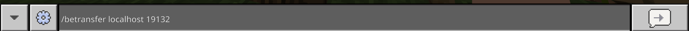

# GeyserServerTransferPlugin

GeyserBedrockPlayerをコマンドで他サーバーに送信できるPlugin 
[English Description & Spigot Page is here！](https://www.spigotmc.org/resources/geyserservertransferplugin.123225/) 

## How to Use?
1. `/betransfer ip port (ユーザー名)` を実行
2. 統合版ユーザーは、入力したサーバーに移動できます！

## Permission
* `GeyserServerTransferPlugin.command.betransfer` コマンドを使って自分自身を別サーバーに移動させるための権限です。
* `GeyserServerTransferPlugin.command.betransferforce` コマンドを使って他プレイヤーを指定して移動させるための権限です。

## Backend Server
BungeeCordやVelocityを使用している場合SpigotやPaperなどバックエンドサーバーにもfloodgateを入れる必要があります。 
詳しくは[Geyser公式のドキュメント](https://geysermc.org/wiki/floodgate/setup/#installing-floodgate-on-servers-behind-the-proxy)をご覧ください。 
2.1.0からProxy側にもこのPluginを入れることでBackend側にfloodgateを入れなくても使用できます。

## Proxy Server
2.0.0からBungeeCord、VelocityのPluginとしても使えるようになりました。 
コマンド、権限はSpigotPluginと同じです。

## Java Edition
Javaのクライアントを使っている方はこちらを使用すると同じことができます。 
[ServerRedirect](https://github.com/KaiKikuchi/ServerRedirect)
